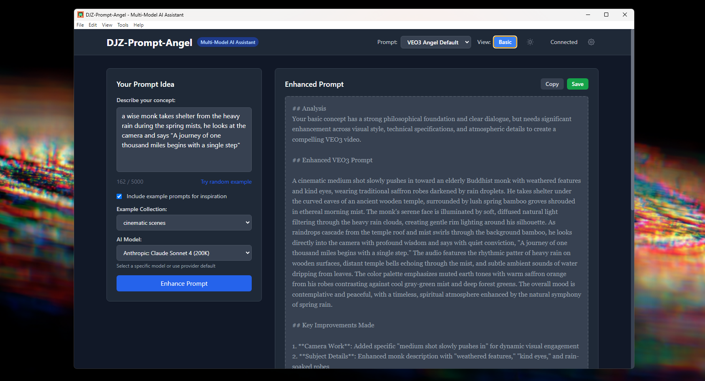

# DJZ-Prompt-Angel v2.5.0 🎯✨

**DJZ-Prompt-Angel** is a model-agnostic AI prompt enhancement desktop application that transforms basic ideas into detailed, optimized prompts for any generative AI model. Built upon the foundation of VEO3-Angel, it has evolved into a universal prompt enhancer with multi-provider support, extensible MD-based datasources, and a modern dark-mode interface.



## 🎯 Project Vision

DJZ-Prompt-Angel aims to provide a **model-agnostic prompt enhancer** that works seamlessly across different AI providers, with **extensible .md-based datasources** for maximum flexibility and customization. Whether you're working with local models through Ollama or accessing hundreds of cloud models via OpenRouter, DJZ-Prompt-Angel adapts to your workflow.

## ✨ Key Features

### 🔄 **Model Agnostic Design**
- **Multi-Provider Support**: Seamlessly switch between Ollama (local) and OpenRouter (300+ cloud models)
- **Universal Enhancement**: Works with any generative AI model, not limited to video generation
- **Provider Abstraction**: Consistent interface regardless of underlying AI provider

### 📝 **Extensible MD-Based System**
- **System Prompt Selection**: Choose from multiple .md-based system prompts via dropdown
- **Custom Prompt Personas**: Easy creation of specialized prompt enhancers
- **Example Collections**: Organized .md files for different prompt categories
- **Easy Customization**: Add new system prompts and examples without code changes

### 🏠 **Local & Cloud Options**
- **Ollama Integration**: Run completely local with free, unlimited usage
- **OpenRouter Access**: 300+ cloud models including GPT-4, Claude, Gemini, Llama
- **Privacy Control**: Choose between local processing or cloud enhancement
- **Fallback Support**: Automatic switching between configured providers

### 🎨 **Modern Interface**
- **Dark Mode by Default**: Professional, eye-friendly interface
- **Responsive Design**: Clean, intuitive layout
- **Real-time Enhancement**: Instant processing with visual feedback
- **Session Management**: Track and export your enhancement history

## 🚀 Quick Start

### Prerequisites

- **Node.js** v16 or higher
- **AI Provider** (choose one or more):
  - [Ollama](https://ollama.ai/) - Local AI (FREE, no API key needed)
  - [OpenRouter API Key](https://openrouter.ai/keys) - Access to 300+ models

### Installation

1. **Clone or download** this repository:
   ```bash
   git https://github.com/MushroomFleet/DJZ-Prompt-Angel
   cd DJZ-Prompt-Angel
   ```

2. **Install dependencies**:
   ```bash
   npm install
   ```

3. **Choose your AI provider setup**:

   **Option A: Ollama (Recommended - Free & Local)**
   ```bash
   # Install Ollama from https://ollama.ai/
   # Pull a model (examples):
   ollama pull llama3.2:3b        # Fast, lightweight
   ollama pull qwen2.5:7b         # Balanced performance
   ollama pull llama3.1:8b        # High quality
   
   # Start Ollama service
   ollama serve
   ```

   **Option B: OpenRouter (Cloud Models)**
   ```bash
   # Get API key from https://openrouter.ai/keys
   # Create .env file:
   cp .env.example .env
   ```
   Edit `.env` and add:
   ```
   OPENROUTER_API_KEY=sk-or-your_actual_api_key_here
   ```

4. **Start the application**:
   ```bash
   npm start
   ```

## 📖 Step-by-Step Usage Guide

### Basic Workflow

1. **Launch DJZ-Prompt-Angel**
   ```bash
   npm start
   ```

2. **Select System Prompt** (top bar dropdown)
   - Choose from available prompt personas
   - Default: "VEO3 Angel (Default)" for video prompts
   - Add custom system prompts to `assets/system-prompts/`

3. **Configure AI Provider** (if first run)
   - Settings gear icon → Configure provider
   - Choose Ollama (local) or OpenRouter (cloud)
   - Test connection and select models

4. **Enter Your Idea**
   - Type basic concept in the input field
   - Example: "A robot exploring Mars"

5. **Choose Enhancement Options**
   - ✅ **Use Examples**: Include relevant examples from selected collection
   - 📊 **View Mode**: Detailed (category breakdown) or Basic (simple enhancement)
   - 🎯 **Model Selection**: Choose specific model from main dropdown (optional)

6. **Enhance Your Prompt**
   - Click "Enhance Prompt" or press `Ctrl+Enter`
   - Watch real-time processing with provider feedback

7. **Review & Use Results**
   - **Enhanced Prompt**: Copy optimized prompt to clipboard
   - **Category Analysis**: See detailed breakdown (Detailed view)
   - **Save Options**: Export as file or save to session history

### Advanced Features

#### System Prompt Management
```bash
# Add new system prompts:
# 1. Create new .md file in assets/system-prompts/
# 2. Restart application
# 3. Select from dropdown in top bar
```

#### Example Collections
```bash
# Add custom example collections:
# 1. Create new .md file in assets/examples/
# 2. Use "Random Example" or select in enhancement options
# 3. Format: standard markdown with examples separated by headers
```

#### Provider Configuration
- **Ollama Setup**: Settings → Test Ollama → Set host to `http://127.0.0.1:11434`
- **OpenRouter Setup**: Settings → Add API key → Select preferred model
- **Multi-Provider**: Configure both for automatic fallback

## 🛠️ Configuration

### Environment Variables

Create `.env` file in project root:

```bash
# OpenRouter (Optional - for cloud models)
OPENROUTER_API_KEY=sk-or-your_key_here

# Application Settings (Optional)
NODE_ENV=production
SERVER_PORT=3000
LOG_LEVEL=info

# Ollama Settings (Optional - defaults work)
OLLAMA_HOST=http://127.0.0.1:11434
```

### System Prompts

Add custom system prompts in `assets/system-prompts/`:

```markdown
# Example: assets/system-prompts/My-Custom-Prompt.md

# My Custom Prompt Enhancer

You are a specialized assistant for [your specific use case].
Your role is to enhance user prompts for [specific purpose].

## Guidelines
- Focus on [specific aspects]
- Include [required elements]
- Optimize for [target outcome]

[Your detailed system prompt content]
```

### Example Collections

Create example collections in `assets/examples/`:

```markdown
# Example: assets/examples/my-examples.md

# My Example Collection

## Example 1
[First example prompt]

## Example 2
[Second example prompt]
```

## 🎮 Keyboard Shortcuts

| Action | Shortcut | Description |
|--------|----------|-------------|
| Enhance Prompt | `Ctrl+Enter` | Process current input |
| Copy Result | `Ctrl+C` | Copy enhanced prompt |
| Random Example | `F1` | Load random example |
| Settings | `Ctrl+,` | Open settings modal |
| Toggle View | `Tab` | Switch Detailed/Basic view |
| Dark Mode | `Ctrl+D` | Toggle light/dark theme |

## 🏗️ Architecture & Technology

### Built Upon VEO3-Angel

DJZ-Prompt-Angel is built upon the solid foundation of **VEO3-Angel**, extending its capabilities to become a universal prompt enhancer:

- **Core Enhancement Engine**: Leverages VEO3-Angel's proven prompt optimization
- **Electron Framework**: Desktop application with cross-platform support
- **Express Backend**: Robust server architecture for AI provider integration
- **Enhanced UI**: Modern dark-mode interface with improved usability

### Technical Stack

- **Frontend**: HTML5, CSS3 (Tailwind), Vanilla JavaScript
- **Backend**: Node.js, Express.js
- **Desktop**: Electron v27
- **AI Integration**: Anthropic SDK, OpenRouter API, Ollama API
- **Storage**: Local file system, localStorage for preferences

### Provider Architecture

```
User Input → DJZ-Prompt-Angel → Provider Selection → AI Processing → Enhanced Output
                    ↓
            [Ollama Local] ← → [OpenRouter Cloud] ← → [Anthropic Direct]
```

## 🔧 Customization Guide

### Adding New System Prompts

1. **Create Prompt File**:
   ```bash
   # Create: assets/system-prompts/Marketing-Assistant.md
   ```

2. **Write System Prompt**:
   ```markdown
   # Marketing Assistant System Prompt
   
   You are a specialized marketing prompt enhancer...
   [Your detailed prompt instructions]
   ```

3. **Restart Application**: New prompt appears in dropdown

### Creating Example Collections

1. **Create Collection File**:
   ```bash
   # Create: assets/examples/marketing-examples.md
   ```

2. **Add Examples**:
   ```markdown
   # Marketing Examples
   
   ## Social Media Campaign
   Create engaging social media content for product launch
   
   ## Email Marketing
   Design compelling email newsletter for customer retention
   ```

3. **Use in Application**: Select from examples dropdown

### Model Configuration

#### Ollama Models
```bash
# Recommended models by use case:

# Fast & Efficient (4GB+ RAM)
ollama pull llama3.2:3b
ollama pull qwen2.5:3b

# Balanced Performance (8GB+ RAM) 
ollama pull llama3.1:8b
ollama pull qwen2.5:7b

# High Quality (16GB+ RAM)
ollama pull qwen2.5:14b
ollama pull llama3.1:70b
```

#### OpenRouter Models
- **Claude 3.5 Sonnet**: Best overall quality
- **GPT-4o**: Creative and detailed prompts
- **Llama 3.1 70B**: Open-source alternative
- **Gemini Pro**: Google's latest model

## 🔒 Privacy & Security

### Local Processing (Ollama)
- ✅ **Complete Privacy**: All processing on your machine
- ✅ **No Internet Required**: Works offline after setup
- ✅ **Zero API Costs**: Unlimited usage with local models
- ✅ **Data Control**: Your prompts never leave your device

### Cloud Processing (OpenRouter)
- ✅ **Secure API**: Encrypted connections only
- ✅ **No Data Storage**: Providers don't retain your prompts
- ✅ **Key Security**: API keys stored locally only
- ✅ **Usage Control**: Monitor costs and usage in real-time

## 🚨 Troubleshooting

### Common Issues

**❌ "No system prompts available"**
- Check `assets/system-prompts/` folder exists
- Ensure at least one .md file is present
- Restart application after adding new prompts

**❌ "Ollama connection failed"**
```bash
# Verify Ollama is running:
ollama serve

# Check available models:
ollama list

# Pull a basic model if none available:
ollama pull llama3.2:3b

# Use IP address instead of localhost:
# Set host to: http://127.0.0.1:11434
```

**❌ "OpenRouter API error"**
- Verify API key starts with `sk-or-`
- Check API key has sufficient credits
- Test connection in Settings → Test OpenRouter

**❌ "Examples not loading"**
- Check `assets/examples/` folder has .md files
- Verify file format is valid markdown
- Use "Refresh" in settings if needed

**❌ "Enhancement takes too long"**
- Local models (Ollama): Normal for first run, speeds up after
- Cloud models: Check internet connection
- Try switching to different model in dropdown

### Getting Help

1. **Check Console Logs**: Look for error messages in terminal
2. **Review Log Files**: Check `logs/` directory for detailed errors
3. **Restart Application**: Many issues resolve with fresh start
4. **Test Providers**: Use Settings → Test All Providers

## 🎯 Use Cases

### Content Creation
- **Blog Posts**: Enhance topic ideas into detailed outlines
- **Social Media**: Transform concepts into engaging content
- **Marketing Copy**: Develop compelling promotional material

### Video Production
- **VEO3 Prompts**: Original video generation focus (default system prompt)
- **Storyboards**: Create detailed scene descriptions
- **Scripts**: Enhance narrative concepts

### Development
- **Code Documentation**: Transform requirements into specifications
- **API Design**: Enhance endpoint descriptions
- **User Stories**: Develop detailed feature requirements

### Creative Writing
- **Story Concepts**: Expand ideas into rich narratives
- **Character Development**: Create detailed character profiles
- **World Building**: Develop immersive environments

## 📊 Performance & Costs

### Ollama (Local) - FREE
- **Cost**: $0 - Completely free
- **Speed**: Fast after model loading (first run slower)
- **Quality**: Excellent with larger models (8B+)
- **Privacy**: 100% local, no data sharing

### OpenRouter (Cloud)
- **Cost**: $0.001-$0.10 per enhancement (varies by model)
- **Speed**: Very fast with good internet
- **Quality**: Access to latest models (GPT-4, Claude, etc.)
- **Usage**: Pay per use, monitor in dashboard

### Recommended Setup
1. **Start with Ollama**: Free, private, unlimited
2. **Add OpenRouter**: For specific high-end models when needed
3. **Configure Fallback**: Automatic switching if one provider fails

## 🔮 Roadmap

### Upcoming Features
- **Custom Prompt Templates**: Save and reuse prompt structures
- **Batch Processing**: Enhance multiple prompts simultaneously
- **Plugin System**: Community-developed enhancements
- **Cloud Sync**: Optional synchronization across devices
- **Advanced Analytics**: Detailed usage and performance metrics

### Community
- **Custom System Prompts**: Share specialized prompt enhancers
- **Example Collections**: Community-contributed prompt libraries
- **Model Recommendations**: Curated model suggestions by use case

## 📜 License & Credits

### License
MIT License - see [LICENSE](LICENSE) file for details.

### Built Upon VEO3-Angel
DJZ-Prompt-Angel is built upon the excellent foundation of **VEO3-Angel**, originally designed for VEO3 video generation prompts. We extend our gratitude to the VEO3-Angel project for providing the core architecture and enhancement capabilities that made this universal prompt enhancer possible.

### Acknowledgments
- **VEO3-Angel Project**: Foundation and core enhancement engine
- **Ollama Team**: Local AI model infrastructure
- **OpenRouter**: Cloud model aggregation platform
- **Electron Team**: Cross-platform desktop framework
- **Community Contributors**: Prompt examples and feedback

## 🤝 Contributing

We welcome contributions to make DJZ-Prompt-Angel even better!

### Ways to Contribute
- **System Prompts**: Create specialized prompt enhancers
- **Example Collections**: Add domain-specific example sets
- **Bug Reports**: Help us identify and fix issues
- **Feature Requests**: Suggest new capabilities
- **Documentation**: Improve guides and tutorials

### Development Setup
```bash
# Clone repository
git clone <repository-url>
cd DJZ-Prompt-Angel

# Install dependencies
npm install

# Start development mode
npm run dev

# Make your changes
# Test thoroughly
# Submit pull request
```

### Creating System Prompts
1. Study existing prompts in `assets/system-prompts/`
2. Create new .md file with descriptive name
3. Test with various input types
4. Submit via pull request with description

## 📞 Support

- 🐛 **Bug Reports**: [GitHub Issues](https://github.com/your-repo/djz-prompt-angel/issues)
- 💡 **Feature Requests**: [GitHub Discussions](https://github.com/your-repo/djz-prompt-angel/discussions)
- 📚 **Documentation**: [Project Wiki](https://github.com/your-repo/djz-prompt-angel/wiki)
- 💬 **Community**: [Discord Server](https://discord.gg/your-server)

---

**Transform any idea into the perfect prompt with DJZ-Prompt-Angel v2.5.0**

*Model-agnostic • Privacy-focused • Endlessly customizable*

**Made with ❤️ for the AI community**
